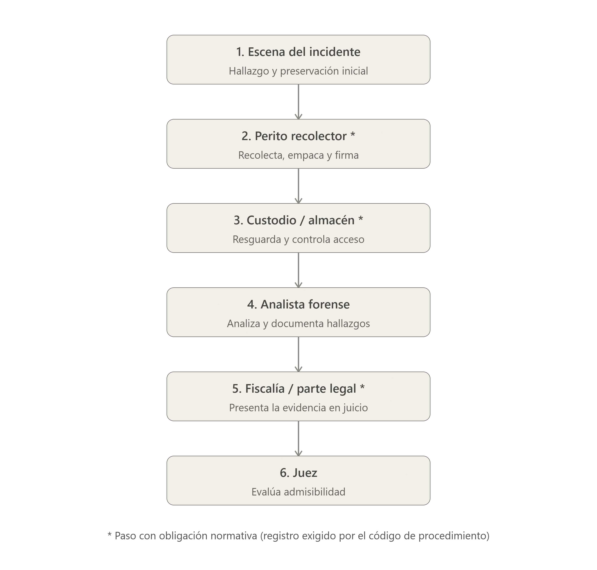

# Problem Brief

## Decisión del problema

### Problema elegido

> El problema ganador en una frase, sin mencionar blockchain, y quién lo propuso.

En el manejo de evidencia digital, no existe forma de comprobar de manera independiente que un archivo no fue alterado en algún punto de la cadena de custodia, entre quien la recolecta, quien la analiza y quien la presenta legalmente.

Propuesto por: Johan Jimenez

### Por qué elegimos este

> Qué inclinó al equipo por este problema frente a los demás, según los criterios de la Sesión 1.

Escogimos este proyecto porque nos llama mucho la atención el alcance de la ciberseguridad y es un área en la que queremos aprender y adquirir experiencia. Además, como grupo consideramos que es una propuesta más completa y unificada para aplicar tecnologías como Blockchain en la protección y manejo de la información.

### Propuestas descartadas

> Cada propuesta considerada, quién la propuso y el motivo del descarte.

Escriban aquí su respuesta.

### Cómo tomamos la decisión

> Cómo llegó el equipo al acuerdo: votación, consenso tras debate u otro.

Como grupo, tomamos la decisión después de compartir nuestras ideas y analizar las diferentes propuestas. Finalmente, coincidimos en que este proyecto era el que más nos llamaba la atención, especialmente por el alcance de la ciberseguridad y la posibilidad de aplicar tecnologías como Blockchain. Por eso decidimos unir nuestros conocimientos y trabajar juntos en esta propuesta.

---

## Problem Brief

### Encabezado

> Nombre del proyecto y una frase que describa el problema. Extensión: breve.

**Nombre del proyecto: CustodiaChain — Cadena de Custodia Verificable de Evidencia Digital**

**Frase del problema:** En un proceso de custodia de evidencia digital que pasa por varias manos, hoy nadie puede demostrar de forma independiente y verificable que el archivo entregado al final es exactamente el mismo que se recolectó al inicio.

### Equipo y roles

> Integrantes con su usuario de GitHub, rol asumido por cada persona, responsable de las entregas y canal de coordinación interna. Extensión: breve.

**Líder de proyecto / Product Owner**
Jonathan Agudelo

**Desarrollador Frontend**
Vacante

**Desarrollador Blockchain / Stellar (SDK)**
- Tito Acosta
- Johan Jimenez

**Desarrollador Soroban (contratos inteligentes)**
- Tito Acosta
- Johan Jimenez

**QA Automatizado**
Vacante

**QA Manual Documentación y evidencia**
- Ana Caicedo

### Problema y evidencia

> Enunciado del problema en una frase, sin mencionar blockchain. Contexto, frecuencia y alcance. Evidencia mínima de que el problema existe: observación directa, experiencia propia, conversaciones o fuentes consultadas, con enlace o cita cuando aplique. Extensión: 150–300 palabras.

**Enunciado del problema (una frase, sin mencionar blockchain):**
En un proceso de custodia de evidencia digital que pasa por varias manos, hoy nadie puede demostrar de forma independiente y verificable que el archivo entregado al final es exactamente el mismo que se recolectó al inicio.

**Contexto, frecuencia y alcance:**
Este problema se presenta en todo proceso judicial, corporativo o de auditoría que involucre evidencia digital (discos, correos, logs, dispositivos móviles): ocurre en cada caso, porque cada uno requiere pasar por al menos recolección, análisis y presentación legal, es decir, mínimo dos o tres traspasos de custodia por caso. El alcance es amplio —aplica tanto a investigaciones penales como a peritajes corporativos o civiles— y afecta a cualquier jurisdicción donde la evidencia digital tenga peso probatorio, no solo a un país o sector específico.

**Evidencia mínima de que el problema existe:**

Un análisis jurisprudencial reciente documenta un caso paradigmático en Argentina donde la nulidad probatoria derivó de una ruptura en la cadena de custodia de evidencias digitales, mostrando que el problema ya ha llegado a tribunales de alto perfil. (repositorio.mpd.gov.ar) 

**observación directa, experiencia propia, conversaciones o fuentes consultadas, con enlace o cita cuando aplique.**

mpd
Un estudio sobre el sistema judicial ecuatoriano encontró que la aplicación práctica de la cadena de custodia digital es limitada por la falta de procedimientos técnicos claros, generando riesgo de inadmisibilidad de la prueba. (dspace.ube.edu.ec) 
ube
Fuentes especializadas en derecho penal señalan que la contaminación de evidencia digital por procedimientos deficientes en la cadena de custodia produce el rechazo judicial de las pruebas periciales. (elderecho.com) 
elderecho

En conjunto, esto confirma que el problema no es hipotético: hay casos reales de evidencia digital descartada o impugnada específicamente por fallas en la cadena de custodia, no por falta de valor probatorio del contenido en sí.

### Usuario y actores

> Quién sufre el problema y qué necesita resolver. Cómo lo resuelve hoy y qué le cuesta en dinero, tiempo o esfuerzo. Demás actores que intervienen en el flujo, con el papel que cumple cada uno. Extensión: 150–300 palabras.

**Quién sufre el problema y qué necesita resolver:**
El perito forense / analista que maneja la evidencia y la fiscalía o parte legal que debe presentarla ante un juez son quienes sufren el problema directamente: necesitan poder demostrar, sin depender únicamente de su propia palabra, que el archivo que presentan hoy es exactamente el mismo que se recolectó en la escena, para que la evidencia no sea impugnada ni descartada por dudas sobre su integridad.

**Cómo lo resuelve hoy y qué le cuesta:**
Hoy lo resuelven con planillas físicas o en Excel firmadas a mano en cada traspaso, o con un sistema interno de gestión de casos donde se duplica el mismo registro de forma digital.

**Tiempo:** diligenciar el formulario en cada traspaso y, ante una disputa, reconstruir manualmente toda la cadena revisando papeles o pidiendo confirmaciones a cada persona involucrada.

**Dinero:** custodia física de la evidencia (bodegas, cajas fuertes, personal dedicado) y horas de personal técnico y legal invertidas en re-verificar y defender la cadena ante impugnaciones.

**Esfuerzo/riesgo:** un solo registro incompleto o inconsistente puede hacer que toda la evidencia sea descartada, perdiendo meses de investigación por una falla administrativa y no técnica.

**Demás actores del flujo y su papel:**

**Primer respondiente / perito recolector** — encuentra y recolecta la evidencia en la escena; genera el primer registro de custodia.

**Custodio / almacén de evidencia **— resguarda físicamente la evidencia entre etapas y controla quién accede a ella.

**Analista forense** — recibe la evidencia, la procesa técnicamente y documenta sus hallazgos.

**Defensa** — cuestiona la validez de la evidencia y puede impugnar la cadena de custodia si encuentra inconsistencias.

**Juez** — decide si la evidencia es admisible con base en si la cadena de custodia está completa y es creíble.

**Auditor externo (en casos corporativos)** — verifica de forma independiente que los procesos de manejo de evidencia se siguieron correctamente.

### Flujo actual de valor

> Recorrido paso a paso de cómo se mueve hoy el dinero, la información o el activo, desde el origen hasta el destino. Diagrama o secuencia numerada, con los intermediarios explícitos. Señalar si algún paso responde a una obligación normativa. Extensión: 150–300 palabras.

Recorrido paso a paso (con intermediarios explícitos y obligación normativa marcada con *):

**Escena del incidente — origen:** se detecta el hallazgo y se inicia la preservación del entorno antes de tocar la evidencia.

Perito recolector* — recolecta el activo (archivo/dispositivo), lo empaca y firma el primer registro de custodia. Este paso responde a una obligación normativa: la mayoría de códigos de procedimiento penal exigen documentar quién recolectó la evidencia y en qué condiciones.

Custodio / almacén* — recibe la evidencia, la resguarda y registra cada acceso (entrada/salida). También normado: se exige dejar constancia de cada persona que tuvo contacto con la evidencia mientras estuvo bajo custodia.
Analista forense — retira la evidencia del almacén (con firma de salida), realiza el análisis técnico y documenta sus hallazgos; luego la retorna al custodio (firma de reingreso).

Fiscalía / parte legal* — solicita la evidencia al custodio para presentarla ante el proceso judicial; este traspaso también exige registro firmado, ya que es el punto donde la defensa puede exigir ver la cadena completa.

Juez — destino final: evalúa si la cadena de custodia está completa y sin discontinuidades para decidir si la evidencia es admisible.

Intermediario constante: el custodio/almacén actúa como intermediario central en casi todos los traspasos (2↔3, 3↔4, 3↔5) — es quien concentra la mayor parte de la confianza del proceso, y por tanto también el mayor punto único de fallo si su registro es incompleto o cuestionable.

### Fricciones identificadas

> Puntos concretos donde el flujo falla, se encarece o se demora. Cada fricción indica en qué paso ocurre, qué la causa y a quién afecta. Extensión: 150–300 palabras.

Con base en el flujo que ya vimos, aquí están los puntos concretos de fricción, ubicados en cada paso:

*Paso 2 → 3 (Perito recolector → Custodio/almacén**

**Fricción:** el traspaso físico depende de transporte manual y de que el formulario en papel llegue completo y legible al almacén.
Causa: no hay validación automática de que el registro esté completo antes de aceptar la evidencia.

**A quién afecta:** al custodio, que puede recibir evidencia con un registro incompleto y quedar como responsable de "cerrar" ese vacío; y al caso completo, que queda con un eslabón débil desde el inicio.
Tipo de costo: tiempo (reprocesos si falta un dato) y riesgo legal.

**Paso 3 (dentro del almacén, en el tiempo)**

**Fricción:** cada acceso a la evidencia (para mostrarla, revisarla, prestarla a otro perito) exige un nuevo registro manual; si el volumen de casos es alto, esto se vuelve tedioso y propenso a omisiones.

**Causa:** el control de acceso depende de la disciplina humana del custodio, no de un mecanismo que fuerce el registro.

**A quién afecta:** al custodio (carga operativa) y, indirectamente, a la fiscalía, que hereda cualquier omisión cuando la evidencia llega a juicio.
Tipo de costo: esfuerzo y dinero (personal dedicado a llevar los registros).

**Paso 3 ↔ 4 (Custodio ↔ Analista forense)**

**Fricción:** cada salida y reingreso de la evidencia para análisis duplica el papeleo, y si el análisis toma varias sesiones, el objeto puede "viajar" varias veces entre almacén y laboratorio.

**Causa:** no existe forma de separar el "análisis" del "objeto físico" — cada acceso técnico exige repetir el mismo proceso de custodia completo.

**A quién afecta:** al analista forense, que pierde tiempo en trámites administrativos en vez de análisis técnico.

**Tipo de costo: tiempo.**

**Paso 3 → 5 (Custodio → Fiscalía)*

**Fricción:** este es el traspaso más sensible: si la fiscalía tarda en solicitar formalmente la evidencia, o si el registro de este paso específico tiene inconsistencias de fecha, es el punto más común donde la defensa cuestiona la cadena completa.

**Causa:** depende de coordinación entre instituciones (custodio judicial/policial y fiscalía), que no siempre comparten el mismo sistema de registro.

**A quién afecta:** a la fiscalía directamente (riesgo de que la evidencia sea impugnada) y, en última instancia, a la investigación completa.

**Tipo de costo:** dinero y esfuerzo (si hay que reconstruir o defender la cadena ante el juez) y, en el peor caso, pérdida total del valor probatorio.

**Paso 5 → 6 (Fiscalía → Juez, momento de impugnación)**

**Fricción:** la defensa puede solicitar la reconstrucción completa de la cadena; si algún registro de los pasos 2-5 está incompleto, ilegible o inconsistente, todo el proceso se detiene mientras se intenta subsanar o defender esa discontinuidad.

**Causa:** no hay manera de que el juez (o la defensa) verifique la integridad por sí mismo sin depender de que las partes presenten y expliquen cada planilla.

**A quién afecta:** al proceso judicial completo — genera demoras en la audiencia, cuestiona la presunción de inocencia si la defensa gana el punto, y puede anular meses de investigación.

**Tipo de costo:** tiempo (demoras procesales) y, en el peor caso, esfuerzo perdido de toda la investigación si se anula la prueba.

**Resumen del cuello de botella principal:** casi toda la fricción se concentra alrededor del custodio/almacén (pasos 2-3, 3-4 y 3-5), porque es el único punto donde se cruza la información de todos los demás actores — es a la vez el intermediario más necesario y el mayor punto único de fallo del flujo completo.

### Oportunidad e hipótesis

> Oportunidad priorizada entre las fricciones identificadas, con el motivo de la elección. Hipótesis inicial de por qué blockchain podría mejorar ese punto, expresada en términos de qué cambiaría para el usuario. Extensión: 150–300 palabras.

**Oportunidad priorizada:** la fricción en el traspaso Custodio → Fiscalía (paso 3→5) y, más ampliamente, todo el registro de accesos que pasa por el custodio/almacén.

**Motivo de la elección:**

Es el punto donde se concentra el mayor impacto: una falla aquí no solo afecta a un actor, sino que pone en riesgo la admisibilidad de toda la evidencia ante el juez.
Es el cuello de botella estructural identificado — el custodio interviene en casi todos los traspasos (2↔3, 3↔4, 3↔5), por lo que resolver la verificabilidad de sus registros mejora el flujo completo, no solo un tramo aislado.
Es un problema de verificación por terceros, no de logística física — no requiere cambiar cómo se transporta o resguarda el objeto, solo cómo se prueba que su historial de custodia es íntegro. Eso lo hace resoluble con un cambio en el registro, sin rediseñar todo el proceso operativo.
Comparado con otras fricciones (ej. la carga operativa del paso 3 en el tiempo, o los reprocesos del paso 2→3), esta es la que más valor probatorio destruye cuando falla — las demás generan demoras o esfuerzo, pero esta puede anular la evidencia por completo.

**Hipótesis inicial:**
Creo, sin certeza aún, que un registro compartido e inalterable de cada evento de custodia podría cambiar lo siguiente para el usuario:

**Para el custodio:** en vez de ser el único responsable de que su papeleo esté "bien llevado", su registro queda respaldado por algo que él mismo tampoco puede alterar retroactivamente — reduce su exposición a ser señalado por errores administrativos que no cometió.

**Para la fiscalía:** en vez de tener que reconstruir manualmente la cadena completa cuando la defensa la cuestiona, podría mostrar la verificación en minutos, con evidencia que cualquiera puede comprobar por sí mismo.

**Para el juez y la defensa:** en vez de depender de la palabra de las instituciones involucradas para aceptar que la cadena está completa, podrían verificar la integridad de forma independiente, sin pedir explicaciones a cada parte.

En síntesis, la hipótesis es que el cambio no está en acelerar el traspaso físico de la evidencia, sino en eliminar la necesidad de confiar en el registro de una sola parte para validar que nada se alteró en el camino — que es justamente el criterio de la sesión 1 sobre compartir un registro entre partes que no confían entre sí.

### Criterio de pertinencia

> Justificación de por qué el caso requiere un registro distribuido y no una base de datos tradicional o una integración entre sistemas existentes. Debe apoyarse en al menos uno de los criterios de la Sesión 1: varias partes que no confían entre sí necesitan compartir un mismo registro, el histórico no puede alterarse, o se elimina un intermediario que hoy concentra la confianza. Extensión: 150–300 palabras.

Por qué no basta una base de datos tradicional ni una integración entre sistemas:

Una base de datos centralizada (aunque esté bien diseñada) o una integración entre los sistemas del custodio, la fiscalía y el juzgado, sigue teniendo un administrador: alguien con permisos para escribir, editar o borrar registros. Aunque hoy ese administrador sea de confianza, el problema real no es la falta de un sistema digital — es que ninguna de las partes involucradas puede probarle a las demás que ese administrador (o alguien con sus credenciales) no alteró el historial. Una integración entre sistemas solo resuelve que la información fluya más rápido entre instituciones; no resuelve la pregunta de fondo: ¿cómo sabe el juez, o la defensa, que lo que ve en el sistema del custodio es exactamente lo que ocurrió, sin depender de la palabra de la institución que lo administra?

Criterio de la Sesión 1 que aplica: varias partes que no confían entre sí necesitan compartir un mismo registro.

En este flujo, el custodio, la fiscalía, la defensa y el juez no son la misma parte, y sus intereses no están alineados — la defensa, en particular, tiene un incentivo legítimo para desconfiar de cualquier registro que las otras partes controlen unilateralmente. Con una base de datos tradicional, la defensa tendría que confiar en que la institución que administra ese sistema no manipuló el historial, incluso si técnicamente pudiera hacerlo. Con un registro distribuido, ninguna de las partes —ni siquiera el custodio o la fiscalía— tiene la capacidad unilateral de reescribir el pasado sin que sea detectable por las demás, porque el registro no vive bajo el control exclusivo de una sola institución.

Criterio adicional que también aplica: se elimina un intermediario que hoy concentra la confianza.

Como identificamos en el análisis de fricciones, el custodio/almacén es hoy el punto único donde se concentra la confianza de todo el proceso — todas las demás partes dependen de que su registro esté bien llevado. Un registro distribuido no elimina al custodio como actor físico (alguien sigue debiendo resguardar el objeto), pero sí elimina su rol como única fuente de verdad sobre la integridad del historial: en vez de que la fiscalía y el juez confíen en el papeleo del custodio, pueden verificar el historial completo por sí mismos, de forma independiente, sin pedirle "permiso" ni depender de su buena fe.

En síntesis: el caso no necesita mover datos más rápido entre sistemas (eso ya lo resolvería una integración); necesita que ninguna parte pueda alterar retroactivamente el historial sin que las demás lo detecten, y eso es precisamente lo que una base de datos tradicional —por más bien integrada que esté— no puede garantizar por diseño, porque siempre depende de un administrador de confianza.

### Supuestos y riesgos

> Dos o tres supuestos que tendrían que ser ciertos para que la hipótesis funcione, y qué podría invalidarla. Extensión: 150–300 palabras.

**Supuestos que tendrían que ser ciertos:**

1. Las partes involucradas (custodio, fiscalía, defensa, juez) están dispuestas a usar y confiar en un registro público/compartido como prueba válida, es decir, que el sistema judicial acepte una transacción en un ledger como evidencia admisible de que un evento de custodia ocurrió en cierto momento — no basta con que sea técnicamente verificable, también debe ser legalmente reconocible.

2. El archivo original (el objeto físico o digital) sigue siendo custodiado de forma segura en el mundo real, y el registro distribuido solo prueba la integridad de su huella (hash) y el historial de quién tuvo acceso — el sistema no resuelve la seguridad física del almacenamiento, solo la verificabilidad de los eventos. Si alguien puede alterar el archivo real sin que eso se refleje en un nuevo evento registrado (por ejemplo, modificando el archivo pero omitiendo declarar el evento), la solución no protege ese caso.

3. Cada actor tiene, y usa correctamente, su propia identidad/clave para firmar los eventos de custodia — si varias personas comparten una misma cuenta o clave, se pierde la trazabilidad de "quién hizo qué", que es la base de todo el valor de la propuesta.

**Qué podría invalidar la hipótesis:**

- Que el sistema legal no reconozca el registro on-chain como prueba suficiente, y exija de todas formas los mismos formularios físicos como respaldo — en ese caso, la solución añadiría un paso extra en vez de reemplazar el actual, sin reducir el esfuerzo real.

- Que la fricción principal no esté en la verificación del historial, sino en la coordinación humana/operativa (por ejemplo, que el problema real sea que las instituciones tardan días en comunicarse entre sí, no que desconfíen del registro) — si ese fuera el caso, el problema se resolvería mejor con una integración de sistemas que con un registro distribuido.

- Que el costo o la complejidad de que cada actor maneje una wallet/clave privada sea mayor que el problema que resuelve — si los peritos y custodios no logran manejar sus claves de forma segura (pérdida, robo, delegación informal a un tercero), se introduce un nuevo punto de falla que podría ser peor que el problema original de las planillas.
